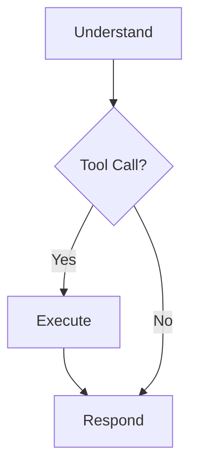

<div align="center">


# Network AI Agent

**A powerful, AI-driven CLI tool for seamless network automation and management.**

<p>
    <a href="https://python.org"></a>
    <a href="#"></a>
    <a href="https://github.com/sydasif/network-automation-agent"></a>
</p>

</div>

The Network AI Agent is a smart, intuitive solution for network automation. By leveraging the power of AI, it simplifies network management, reduces manual effort, and empowers network engineers to focus on more strategic initiatives.

---

## 🚀 Key Features

- **🤖 AI-Powered Network Commands**: Use natural language to manage network devices.
- **🌐 Multi-Device Support**: Execute commands across multiple devices simultaneously.
- **⚡ Parallel Execution**: Efficiently process commands in parallel.
- **📊 Structured Output**: Receive beautifully formatted output for easy readability.
- **🔗 Workflow Management**: Manage complex network workflows with a powerful state machine.
- **🔒 Secure Device Access**: Ensure secure device communication with SSH connectivity.

---

## 📦 Installation & Configuration

Get up and running with the Network AI Agent in a few simple steps.

### Prerequisites

- Python 3.12+
- `uv` package manager
- SSH access to your network devices
- A Groq API key for AI functionality

### Setup Instructions

1. **Clone the repository**:

    ```bash
    git clone https://github.com/sydasif/network-automation-agent.git
    cd network-agent
    ```

2. **Install dependencies**:

    ```bash
    uv sync
    ```

3. **Configure your environment**:

    ```bash
    cp .env.example .env
    ```

    Then, add your Groq API key to the newly created `.env` file.

4. **Configure and Migrate Network Devices**:
    The device inventory is managed by a SQLite database (`inventory.db`). To populate it, first add your network device details to the `hosts.yaml` file, then run the migration script:

    ```bash
    uv run hosts.py
    ```

    This will create an `inventory.db` file. After migration, the `hosts.yaml` file is no longer used.

---

## 🎮 Quick Start

To run the agent in interactive mode, use the following command:

```bash
uv run main.py
```

You can then enter commands in natural language, such as:

- "Show me the version of router-1"
- "Show interfaces on switch-1"
- "Show version on all devices"

---

## 🎬 Usage Snapshot

Here's a snapshot of the Network AI Agent in action:

<details>
<summary>Click to see the full usage example</summary>

```bash
❯ python main.py
🤖 Network AI Agent Ready! (Type 'quit' to exit)

You: Hi, what you can do?

🤖 Agent: Sure! Here’s a quick snapshot of what I can help you with:

| What I can do | How I’ll help |
|---------------|---------------|
| **Run show commands** | Execute `show` commands (e.g., `show version`, `show interfaces`, `show running-config`) on your switches (`sw1`, `sw2`). |
| **Apply configuration changes** | Use `config_command` to push config updates (interfaces, VLANs, routing, etc.). I’ll confirm the exact changes before sending them to the device. |
| **Verify device type** | I’ll always check the device type first to avoid mis‑commands. |
| **Answer questions** | Explain network concepts, troubleshoot common issues, or walk you through best practices. |

Just let me know what you’d like to do—whether it’s a quick status check or a configuration tweak—and I’ll take care of it!

You: Check vlans on all device

🤖 Agent: **VLANs on all devices**

| Device | VLAN ID | VLAN Name      | Status      | Interfaces |
|--------|---------|----------------|-------------|------------|
| **sw1** | 1   | default        | active      | Et0/3 |
|        | 10  | VLAN0010       | active      | – |
|        | 100 | site_a         | active      | Et0/2 |
|        | 1002 | fddi-default  | act/unsup   | – |
|        | 1003 | token-ring-default | act/unsup | – |
|        | 1004 | fddinet-default | act/unsup | – |
|        | 1005 | trnet-default | act/unsup   | – |

| Device | VLAN ID | VLAN Name      | Status      | Interfaces |
|--------|---------|----------------|-------------|------------|
| **sw2** | 1   | default        | active      | Et0/3 |
|        | 100 | site_b         | active      | Et0/2 |
|        | 1002 | fddi-default  | act/unsup   | – |
|        | 1003 | token-ring-default | act/unsup | – |
|        | 1004 | fddinet-default | act/unsup | – |
|        | 1005 | trnet-default | act/unsup   | – |

*All commands succeeded and returned the current VLAN configuration for each switch.*

You: remove vlan 10 from sw1

⚠️  APPROVAL REQUIRED ⚠️
Action:  config_command
Args:    {'configs': ['no vlan 10'], 'device': 'sw1'}
Authorize? (yes/no): yes

🤖 Agent: **Configuration change applied**

- **Device:** `sw1`
- **Command executed:** `no vlan 10`
- **Result:** VLAN 10 has been removed from the switch configuration. No errors were reported.

You: quit
Goodbye!
```

</details>

---

## 🏗️ Architecture

The agent is built on a `LangGraph`-based state machine with three main nodes:

1. **Understand**: Parses the user's intent to extract device names and commands.
2. **Execute**: Runs the network commands on the specified devices.
3. **Respond**: Formats and returns the results to the user.

<div align="center">



</div>

---

## 📚 Documentation

For detailed API and component documentation, please see the [DOCUMENTATION.md](DOCUMENTATION.md) file.

---

## 🤝 Contributing

Contributions are welcome! If you'd like to contribute, please follow these steps:

1. Fork the repository.
2. Create a new branch (`git checkout -b feature/your-feature-name`).
3. Make your changes and commit them (`git commit -m 'Add some feature'`).
4. Push to the branch (`git push origin feature/your-feature-name`).
5. Open a pull request.

---

## 📄 License

This project is licensed under the MIT License. See the `LICENSE` file for details.
