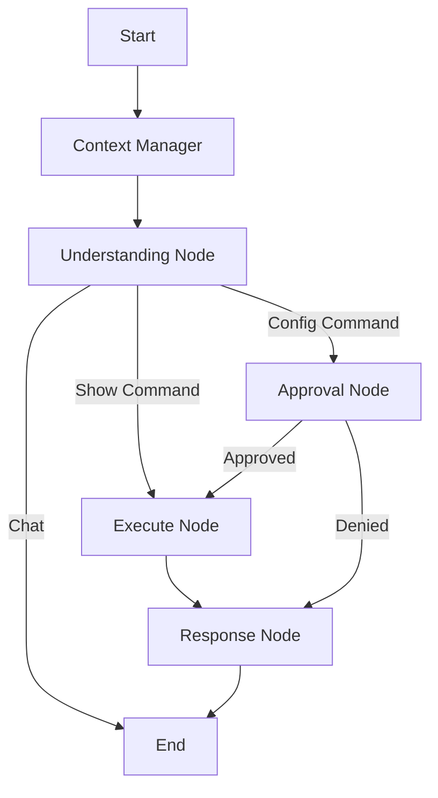

# Network Automation Agent 🤖

An AI-powered network automation assistant that uses natural language to manage network devices. Built with **LangGraph**, **Groq (Llama 3.3)**, and **Nornir**.

## ✨ Features

- **Linear Pipeline Architecture**: A deterministic "One-Shot" workflow (`Intent` → `Action` → `Summary`) that eliminates infinite loops and ensures predictable behavior.
- **Natural Language Interface**: Describe intents in plain English (e.g., "Show interfaces on R1" or "Configure VLAN 10 on Switch 2").
- **Structured Outputs**: Uses **Pydantic** to enforce strict data schemas, ensuring the AI produces clean Markdown summaries and structured JSON every time.
- **Smart Context Management**: Intelligently compresses massive network outputs (like `show running-config`) to maintain long conversation history without hitting token limits.
- **Human-in-the-Loop**: Critical configuration changes trigger an interrupt, requiring explicit user approval via CLI before execution.
- **Multi-Vendor Support**: Works with Cisco IOS/XE, Arista EOS, Juniper Junos, etc. (via Netmiko/Nornir).
- **Enhanced Validation & Risk Assessment**: Advanced validation layer that checks commands against device inventory and assesses risk of configuration changes before execution.
- **Safety-First Design**: Multiple validation layers prevent unauthorized or dangerous operations on network devices.

## 🏗️ Architecture

The application follows a **Linear Pipeline** design to ensure safety and reliability in network operations:



### Workflow Logic

1. **Message Manager**: Compresses old tool outputs to save tokens while keeping the conversation flow intact.
2. **Understanding Node**: Analyzes user intent and selects the appropriate tool (`show_command` or `config_command`) with enhanced validation.
3. **Approval Node**: Intercepts state-changing commands. Pauses for user confirmation with risk assessment.
4. **Execute Node**: Runs Nornir tasks against live devices and bundles the raw output.
5. **Response Node**: Analyzes the raw execution data and generates a professional Markdown summary using strict Pydantic schemas.

### Package Structure

```text
network-automation-agent/
├── agent/                  # AI Logic
│   ├── workflow_manager.py # Linear Graph definition
│   ├── schemas.py          # Pydantic output models
│   ├── prompts.py          # System prompts
│   ├── nodes.py            # All workflow nodes (understanding, execute, approval, response)
│   ├── state.py            # State definitions
│   └── constants.py        # Shared constants
├── core/                   # Infrastructure
│   ├── config.py           # Configuration management
│   ├── nornir_manager.py   # Device connectivity
│   ├── llm_provider.py     # LLM client factory
│   ├── message_manager.py  # Token optimization
│   ├── device_inventory.py # Device validation
│   └── task_executor.py    # Task execution
├── tools/                  # Capabilities
│   ├── show_tool.py        # Read-only commands
│   ├── config_tool.py      # Config changes
│   ├── registry.py         # Tool registry
│   └── validators.py       # Input validation
├── cli/                    # User Interface
│   ├── application.py      # Main application logic
│   ├── orchestrator.py     # Workflow orchestration
│   └── bootstrapper.py     # Dependency initialization
├── ui/                     # Presentation
│   └── console_ui.py       # Rich-based terminal UI
├── utils/                  # Utilities
│   ├── logger.py           # Logging utilities
│   └── responses.py        # Response helpers
├── main.py                 # Application entry point
├── hosts.yaml              # Device inventory
├── groups.yaml             # Device groups
├── config.yaml             # Application configuration
├── pyproject.toml          # Project dependencies
└── uv.lock                 # Dependency lock file
```

## 🚀 Quick Start

### Prerequisites

- Python 3.12+
- `uv` package manager (recommended) or `pip`
- Network devices with SSH access
- Groq API key

### Installation

1. **Clone the repository:**

    ```bash
    git clone <repository-url>
    cd network-automation-agent
    ```

2. **Install dependencies with uv:**

    ```bash
    # Install uv if you don't have it
    pip install uv

    # Sync project dependencies
    uv sync
    ```

3. **Configure Environment:**

    ```bash
    # Copy the example environment file
    cp .env.example .env
    # Edit .env and add your Groq API key: GROQ_API_KEY=your_key_here
    ```

4. **Configure Device Inventory:**
    Edit `hosts.yaml` and `groups.yaml` to match your network environment:

    ```yaml
    # hosts.yaml - Define your network devices
    r1:
      hostname: 192.168.1.1
      groups: [cisco]
    s1:
      hostname: 192.168.1.2
      groups: [arista]

    # groups.yaml - Define device groups and credentials
    cisco:
      platform: cisco_ios
      username: admin
      password: secure_password
    arista:
      platform: arista_eos
      username: admin
      password: secure_password
    ```

### Usage

**Interactive Chat Mode (Recommended):**

```bash
uv run python main.py --chat
```

**Single Command Mode:**

```bash
uv run python main.py "show ip interface brief on R1"
```

**Specify Target Device:**

```bash
uv run python main.py --device R1 "show version"
```

**Debug Mode:**

```bash
uv run python main.py --chat --debug
```

## 🔧 Configuration

### Application Configuration (config.yaml)

The application uses a Nornir-based configuration that supports:

- Inventory management (host and group files)
- Parallel execution settings (num_workers)
- Connection timeouts and options
- Logging configuration

Key settings that can be overridden via environment variables:
- `NUM_WORKERS`: Number of parallel workers (default: 20)
- `NETMIKO_TIMEOUT`: Command timeout in seconds (default: 30)
- `NETMIKO_CONN_TIMEOUT`: Connection timeout in seconds (default: 10)
- `NETMIKO_SESSION_TIMEOUT`: Session timeout in seconds (default: 60)

### Environment Variables

Required:
- `GROQ_API_KEY`: API key for Groq cloud service

Optional:
- `NUM_WORKERS`: Number of concurrent connections to devices
- `NETMIKO_TIMEOUT`: Command execution timeout
- `NETMIKO_CONN_TIMEOUT`: Device connection timeout
- `NETMIKO_SESSION_TIMEOUT`: Session timeout

## 🛡️ Safety & Validation

### Multi-Layer Validation System

The agent implements multiple layers of safety:

1. **Device Inventory Validation**: Ensures target devices exist before execution
2. **Command Validation**: Validates command syntax and safety
3. **Risk Assessment**: Evaluates configuration commands for potential risks
4. **Human Approval**: Critical changes require explicit user confirmation

### Command Types

- **Show Commands**: Execute directly after validation
- **Config Commands**: Require explicit user approval with risk assessment

## 🧪 Testing

Run the test suite to ensure everything works correctly:

```bash
# Run all tests
uv run pytest

# Run specific test file
uv run pytest tests/unit/test_core/test_config.py

# Run with verbose output
uv run pytest -v

# Run integration tests
uv run pytest tests/integration/
```

## 🤝 Contributing

1. Fork the repository
2. Create a feature branch (`git checkout -b feature/amazing-feature`)
3. Make your changes
4. Add tests if applicable
5. Ensure tests pass: `uv run pytest`
6. Commit your changes with descriptive messages
7. Push to the branch: `git push origin feature/amazing-feature`
8. Open a pull request

### Development Commands

- Install dependencies: `uv sync`
- Add new dependency: `uv add package_name`
- Update dependencies: `uv sync --refresh`
- Run tests: `uv run pytest`
- Run with debug: `uv run python main.py --chat --debug`

## 📄 License

This project is licensed under the MIT License - see the LICENSE file for details.

## 🚨 Disclaimer

This tool is designed for managing network infrastructure. Use responsibly and ensure you have proper authorization before connecting to any network devices. The authors are not responsible for any damage caused by misuse of this tool.
