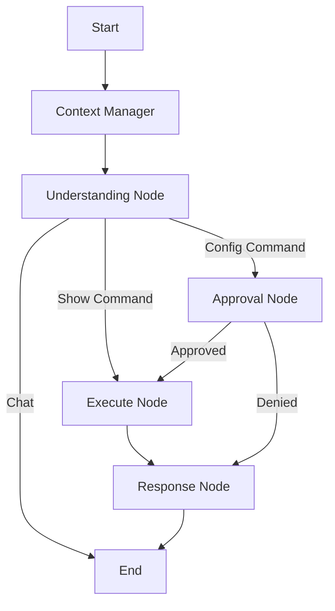

# Network Automation Agent 🤖

An AI-powered network automation assistant that uses natural language to manage network devices. Built with **LangGraph**, **Groq (Llama 3.3)**, and **Nornir**.

## ✨ Features

- **Linear Pipeline Architecture**: A deterministic "One-Shot" workflow (`Intent` → `Action` → `Summary`) that eliminates infinite loops and ensures predictable behavior.
- **Natural Language Interface**: Describe intents in plain English (e.g., "Show interfaces on R1" or "Configure VLAN 10 on Switch 2").
- **Structured Outputs**: Uses **Pydantic** to enforce strict data schemas, ensuring the AI produces clean Markdown summaries and structured JSON every time.
- **Smart Context Management**: Intelligently compresses massive network outputs (like `show running-config`) to maintain long conversation history without hitting token limits.
- **Human-in-the-Loop**: Critical configuration changes trigger an interrupt, requiring explicit user approval via CLI before execution.
- **Multi-Vendor Support**: Works with Cisco IOS/XE, Arista EOS, Juniper Junos, etc. (via Netmiko/Nornir).

## 🏗️ Architecture

The application follows a **Linear Pipeline** design to ensure safety and reliability in network operations:



### Workflow Logic

1. **Message Manager**: Compresses old tool outputs to save tokens while keeping the conversation flow intact.
2. **Understanding Node**: Analyzes user intent and selects the appropriate tool (`show_command` or `config_command`).
3. **Approval Node**: Intercepts state-changing commands. Pauses for user confirmation.
4. **Execute Node**: Runs Nornir tasks against live devices and bundles the raw output.
5. **Response Node**: Analyzes the raw execution data and generates a professional Markdown summary using strict Pydantic schemas.

### Package Structure

```text
network-automation-agent/
├── agent/                  # AI Logic
│   ├── workflow_manager.py # Linear Graph definition
│   ├── schemas.py          # Pydantic output models
│   ├── prompts.py          # System prompts
│   ├── nodes.py            # All workflow nodes (understanding, execute, approval, response)
│   ├── state.py            # State definitions
│   └── constants.py        # Shared constants
├── core/                   # Infrastructure
│   ├── config.py           # Configuration management
│   ├── nornir_manager.py   # Device connectivity
│   ├── llm_provider.py     # LLM client factory
│   ├── message_manager.py  # Token optimization
│   ├── device_inventory.py # Device validation
│   └── task_executor.py    # Task execution
├── tools/                  # Capabilities
│   ├── show_tool.py        # Read-only commands
│   ├── config_tool.py      # Config changes
│   ├── registry.py         # Tool registry
│   └── validators.py       # Input validation
├── cli/                    # User Interface
│   ├── application.py      # Main application logic
│   ├── orchestrator.py     # Workflow orchestration
│   └── bootstrapper.py     # Dependency initialization
├── ui/                     # Presentation
│   └── console_ui.py       # Rich-based terminal UI
├── utils/                  # Utilities
│   ├── logger.py           # Logging utilities
│   └── responses.py        # Response helpers
├── main.py                 # Application entry point
├── hosts.yaml              # Device inventory
├── groups.yaml             # Device groups
├── config.yaml             # Application configuration
├── pyproject.toml          # Project dependencies
└── uv.lock                 # Dependency lock file
```

## 🚀 Quick Start

### Prerequisites

- Python 3.12+
- `uv` package manager (recommended) or `pip`
- Network devices with SSH access
- Groq API key

### Installation

1. **Clone the repository:**

    ```bash
    git clone <repository-url>
    cd network-automation-agent
    ```

2. **Install dependencies:**

    ```bash
    uv sync
    ```

3. **Configure Environment:**

    ```bash
    cp .env.example .env
    # Edit .env and add: GROQ_API_KEY=your_key_here
    ```

4. **Define Inventory:**
    Edit `hosts.yaml` and `groups.yaml` to match your lab/network environment.

### Usage

**Interactive Chat Mode (Recommended):**

```bash
uv run python main.py --chat
```

**Single Command Mode:**

```bash
uv run python main.py "show ip interface brief on R1"
```

**Debug Mode:**

```bash
uv run python main.py --chat --debug
```

## 🧠 Key Concepts

### Linear vs Cyclic

Unlike "ReAct" agents that loop until they decide to stop, this agent creates a **Single Execution Plan**. This prevents the AI from "thinking out loud" or hallucinating follow-up commands, making it safer for production networks.

### Safety First

- **Validation**: Tools validate that target devices exist in the inventory before execution.
- **Approval**: Any state-changing command (`config_command`) requires explicit user confirmation.
- **Strict Parsing**: Output is parsed into `AgentResponse` objects, preventing malformed JSON errors.

## 🤝 Contributing

1. Fork the repository
2. Create a feature branch
3. Make your changes
4. Ensure tests pass: `uv run pytest`
5. Submit a pull request
