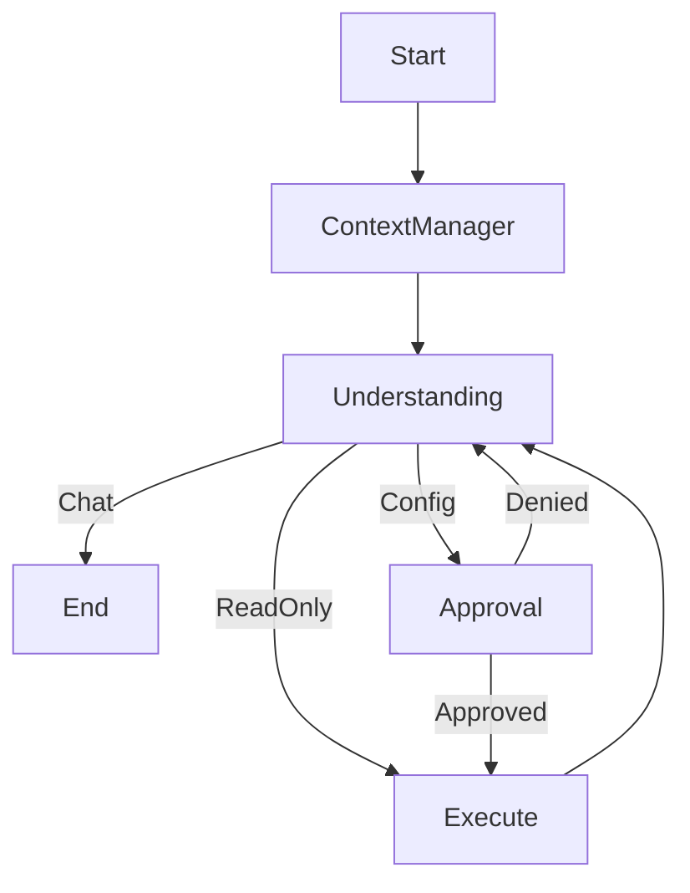

# Network Automation Agent 🤖

An AI-powered network automation assistant that uses natural language to manage network devices. Built with **LangGraph** (ReAct Architecture), **Groq LLM** (Llama 3), and **Nornir**.

## ✨ Features

- **Cyclic ReAct Architecture**: The agent "Reasons" and "Acts" in a loop, allowing it to analyze command outputs and self-correct or chain multiple dependent tasks.
- **Natural Language Interface**: Describe complex network intents in plain English (e.g., "Troubleshoot OSPF on R1").
- **Human-in-the-Loop**: Critical configuration changes trigger an interrupt, requiring explicit user approval via CLI before execution.
- **Multi-Vendor Support**: Works with Cisco IOS/XE, Arista EOS, Juniper Junos, etc. (via Netmiko/Nornir).
- **Token Efficient**: Optimized XML-based prompts and memory middleware to minimize LLM costs and latency.
- **State Persistence**: Uses SQLite to remember conversation context and execution history across sessions.

## 🏗️ Architecture

The application follows a **modular, class-based architecture** orchestrated by a cyclic state graph:



### Workflow Logic

1. **Context Manager**: Loads conversation history and sanitizes it to fit token limits.
2. **Understanding Node**: The "Brain". It analyzes user intent and selects the appropriate tool (`show`, `config`, or `plan`).
3. **Approval Node**: Intercepts `config_command` calls. It pauses execution until the user types "yes". If denied, it feeds the error back to the Understanding node.
4. **Execute Node**: Runs the Nornir tasks against live devices.
5. **ReAct Loop**: The output of the execution is fed *back* into the Understanding node, allowing the AI to summarize results or decide on the next step.

### Package Structure

```text
network-automation-agent/
├── agent/                  # AI Logic
│   ├── workflow_manager.py # Graph definition
│   ├── prompts.py          # XML-based system prompts
│   └── nodes/              # Workflow steps
│       ├── understanding_node.py
│       ├── execute_node.py
│       ├── approval_node.py
│       └── planner_node.py
├── core/                   # Infrastructure
│   ├── nornir_manager.py   # Device connectivity
│   ├── task_executor.py    # Error handling wrapper
│   └── llm_provider.py     # Groq client factory
├── tools/                  # Capabilities
│   ├── show_tool.py        # Read-only commands
│   ├── config_tool.py      # Config changes
│   └── multi_command.py    # Planning logic
├── cli/                    # User Interface
│   └── application.py      # App lifecycle
└── ui/                     # Presentation
    └── console_ui.py       # Rich-based terminal UI
```

## 🚀 Quick Start

### Prerequisites

- Python 3.12+
- `uv` package manager (recommended) or `pip`
- Network devices with SSH access
- Groq API key

### Installation

1. **Clone the repository:**

    ```bash
    git clone <repository-url>
    cd network-automation-agent
    ```

2. **Install dependencies:**

    ```bash
    uv sync
    ```

3. **Configure Environment:**

    ```bash
    cp .env.example .env
    # Edit .env and add: GROQ_API_KEY=your_key_here
    ```

4. **Define Inventory:**
    Edit `hosts.yaml` and `groups.yaml` to match your lab/network environment.

### Usage

**Interactive Chat Mode (Recommended):**

```bash
uv run python main.py --chat
```

**Single Command Mode:**

```bash
uv run python main.py "show ip interface brief on R1"
```

**Debug Mode:**

```bash
uv run python main.py --chat --debug
```

## 🧠 Key Concepts

### ReAct Pattern vs Linear Chain

Unlike simple chatbots that go `Input -> LLM -> Tool -> Output`, this agent uses a **loop**.

- *User*: "Fix BGP on R1"
- *Agent*: Runs `show ip bgp summary`.
- *Agent*: Sees neighbor is Idle. Decides to run `show run | s bgp`.
- *Agent*: Sees wrong neighbor IP. Asks for `config` approval.
- *Agent*: Applies fix. Verifies with `show ip bgp summary` again.
- *Agent*: Reports "Fixed" to user.

### Memory Middleware

To prevent `413 Request Entity Too Large` errors when dealing with massive network outputs (like `show tech-support`), the `ContextManager` uses smart trimming strategies to keep the context window focused on the most recent relevant information.

### Safety First

- **Validation**: Tools automatically validate that target devices exist in the inventory before execution.

- **Approval**: Any state-changing command (`config_command`) requires explicit user confirmation.
- **Error Handling**: Netmiko exceptions (Timeout, Auth) are caught and presented to the LLM, allowing it to suggest troubleshooting steps (e.g., "Check firewall").

## 🤝 Contributing

1. Fork the repository
2. Create a feature branch
3. Make your changes
4. Ensure tests pass: `uv run pytest`
5. Submit a pull request

---

**Made with ❤️ for Network Engineers**
