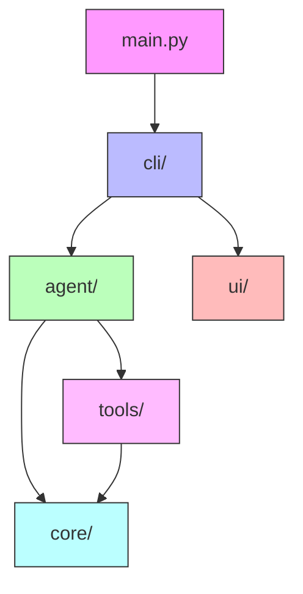
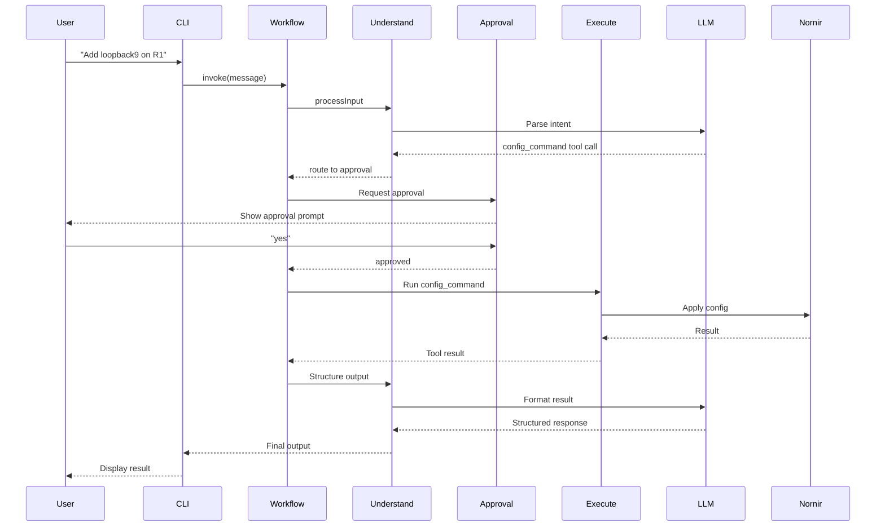

# Architecture Documentation

## Overview

The Network Automation Agent follows a **modular, class-based architecture** with strict separation of concerns and dependency injection throughout.

## Design Principles

### 1. SOLID Principles

- **Single Responsibility**: Each class has one clear purpose
- **Open/Closed**: Plugin architecture allows extension without modification
- **Liskov Substitution**: Base classes define clear contracts
- **Interface Segregation**: Minimal, focused interfaces
- **Dependency Inversion**: Depend on abstractions, not concretions

### 2. Dependency Injection

All dependencies are injected via constructors:

```python
class NetworkAgentCLI:
    def __init__(self, config: NetworkAgentConfig):
        self._nornir_manager = NornirManager(config)
        self._device_inventory = DeviceInventory(self._nornir_manager)
        self._task_executor = TaskExecutor(self._nornir_manager)
        # ...
```

### 3. Lazy Loading

Resource-intensive objects are created only when needed:

```python
@property
def nornir(self):
    if self._nornir is None:
        self._nornir = self._initialize_nornir()
    return self._nornir
```

## Package Structure



### Dependency Flow

```
core/           (No dependencies on other packages)
  ↓
tools/          (Depends only on core/)
  ↓
agent/          (Depends on core/ and tools/)
  ↓
cli/            (Depends on all packages)
  ↓
main.py         (Entry point)
```

## Core Package (`core/`)

### Purpose

Provides foundational infrastructure for the entire application.

### Classes

#### NetworkAgentConfig

**Purpose**: Centralized configuration management
**Responsibilities**:

- Load environment variables from `.env`
- Validate required settings
- Provide clean property-based API

```python
config = NetworkAgentConfig()
config.validate()  # Ensures GROQ_API_KEY is set
api_key = config.groq_api_key
```

#### NornirManager

**Purpose**: Nornir instance lifecycle management
**Responsibilities**:

- Lazy-load Nornir instance
- Provide host filtering
- Manage connection cleanup

```python
manager = NornirManager(config)
hosts = manager.get_hosts()  # Dict of all hosts
filtered = manager.filter_hosts(['R1', 'R2'])
manager.close()  # Cleanup connections
```

#### DeviceInventory

**Purpose**: Device information and validation
**Responsibilities**:

- Query device details
- Validate device names
- Cache device information

```python
inventory = DeviceInventory(nornir_manager)
device_info = inventory.get_device_info()  # For LLM prompts
valid, invalid = inventory.validate_devices(['R1', 'R2'])
```

#### TaskExecutor

**Purpose**: Execute Nornir tasks with error handling
**Responsibilities**:

- Run tasks on devices
- Handle network errors (timeout, auth failures)
- Format results consistently

```python
executor = TaskExecutor(nornir_manager)
results = executor.execute_task(
    target_devices=['R1'],
    task_function=netmiko_send_command,
    command_string='show version'
)
```

#### LLMProvider

**Purpose**: LLM instance management
**Responsibilities**:

- Create and cache LLM instances
- Bind tools to LLM
- Support structured output

```python
provider = LLMProvider(config)
llm = provider.get_llm()
llm_with_tools = provider.get_llm_with_tools(tools)
```

## Tools Package (`tools/`)

### Purpose

Provides network automation capabilities through a plugin architecture.

### Base Class

#### NetworkTool (Abstract)

**Purpose**: Define tool interface
**Required Methods**:

- `name` - Tool identifier
- `description` - What the tool does
- `args_schema` - Pydantic model for arguments
- `_execute_impl` - Implementation logic
- `to_langchain_tool()` - Convert to LangChain format

### Tool Implementations

#### ShowCommandTool

- **Purpose**: Execute read-only show commands
- **Dependencies**: TaskExecutor
- **Example**: `show version`, `show ip interface brief`

#### ConfigCommandTool

- **Purpose**: Apply configuration changes
- **Dependencies**: TaskExecutor
- **Approval**: Requires human approval
- **Example**: Add interface, change IP address

#### PlannerTool

- **Purpose**: Break down complex tasks
- **Example**: "Upgrade all switches" becomes step-by-step plan

#### ResponseTool

- **Purpose**: Send final response to user
- **Signals**: End of workflow

### Tool Registry

```python
def get_all_tools(task_executor: TaskExecutor) -> list:
    tools = [
        ShowCommandTool(task_executor),
        ConfigCommandTool(task_executor),
        PlannerTool(),
        ResponseTool(),
    ]
    return [tool.to_langchain_tool() for tool in tools]
```

## Agent Package (`agent/`)

### Purpose

Implements the LangGraph workflow and decision logic.

### Workflow Manager

#### NetworkAgentWorkflow

**Purpose**: Orchestrate the LangGraph workflow
**Responsibilities**:

- Build workflow graph
- Define routing logic
- Manage workflow state

```python
workflow = NetworkAgentWorkflow(
    llm_provider=llm_provider,
    device_inventory=device_inventory,
    task_executor=task_executor,
    tools=tools
)
graph = workflow.build()
```

### Node Classes

#### AgentNode (Abstract Base)

**Purpose**: Define node interface
**Methods**:

- `execute(state)` - Process workflow state
- `_get_llm()` - Access LLM
- `_get_llm_with_tools(tools)` - Get LLM with tools
- `_get_structured_llm(schema)` - Get structured LLM

#### UnderstandNode

**Purpose**: Process input and structure output
**Modes**:

1. **User Input**: Route to appropriate tools
2. **Tool Output**: Structure into NetworkResponse format

**Features**:

- Context window management
- Message trimming
- Conversation summarization

#### ApprovalNode

**Purpose**: Human-in-the-loop approval
**Workflow**:

1. Check if config_command is being called
2. Interrupt workflow
3. Wait for user decision (yes/no)
4. Resume or deny based on response

#### ExecuteNode

**Purpose**: Execute tools
**Implementation**: Wraps LangGraph's ToolNode

#### PlannerNode

**Purpose**: Generate execution plans
**Output**: Step-by-step breakdown of complex tasks

### State Management

```python
class State(TypedDict):
    messages: Annotated[list, add_messages]
```

## CLI Package (`cli/`)

### Purpose

Manage application lifecycle and user interaction.

### Classes

#### NetworkAgentCLI

**Purpose**: Main application class
**Responsibilities**:

- Initialize all components
- Coordinate workflow execution
- Handle single command and chat modes
- Manage approval workflow

**Key Methods**:

- `run_single_command(command, device)` - Execute one command
- `run_interactive_chat(device)` - Start chat session
- `cleanup()` - Resource cleanup

#### CommandProcessor

**Purpose**: Parse and validate commands
**Features**:

- Extract device references
- Validate device names
- Suggest device names (autocomplete)

## UI Package (`ui/`)

### Purpose

Provide console user interface.

### Classes

#### NetworkAgentUI

**Purpose**: Console UI management
**Features**:

- Rich formatting (colors, tables, markdown)
- Approval requests
- Status spinners
- Error/warning messages

#### ColoredLogHandler

**Purpose**: Custom log formatting
**Features**:

- Color-coded by log level
- Filter verbose third-party logs
- Separate logging from user interaction

## Workflow Execution Flow



## Error Handling Strategy

### Network Errors

- Connection timeouts → User-friendly message
- Authentication failures → Check credentials message
- Device unreachable → Network connectivity message

### LLM Errors

- Rate limits → Retry with backoff
- API errors → Fallback to raw output
- Structured output failures → Manual JSON parsing

### Application Errors

- Configuration missing → Clear validation error
- Invalid device names → Suggestions provided
- Workflow errors → Logged with context

## Testing Strategy

### Unit Tests

- Each class tested in isolation
- Dependencies mocked
- Focus on business logic

### Integration Tests

- Test component interactions
- Use test fixtures for devices
- Verify end-to-end workflows

### Example Structure

```
tests/
├── unit/
│   ├── test_core/
│   │   ├── test_config.py
│   │   ├── test_nornir_manager.py
│   │   └── test_device_inventory.py
│   ├── test_tools/
│   └── test_agent/
└── integration/
    ├── test_workflow.py
    └── test_cli.py
```

## Extension Points

### Adding New Tools

1. Create class inheriting from `NetworkTool`
2. Implement required methods
3. Register in `tools/__init__.py`

### Adding New Nodes

1. Create class inheriting from `AgentNode`
2. Implement `execute(state)` method
3. Add to workflow in `NetworkAgentWorkflow`

### Custom LLM Providers

1. Create new provider class similar to `LLMProvider`
2. Implement same interface
3. Inject into components

## Performance Considerations

### Parallel Execution

- Nornir executes tasks across devices in parallel
- Configurable thread pool size

### Lazy Loading

- LLM instances created only when needed
- Nornir initialized on first use

### Caching

- Device inventory cached in memory
- LLM instances reused across requests

### Resource Management

- Connections closed on cleanup
- Memory released after workflow completion

---

**Last Updated**: 2025-12-01
**Version**: 2.0.0 (Class-based refactoring)
